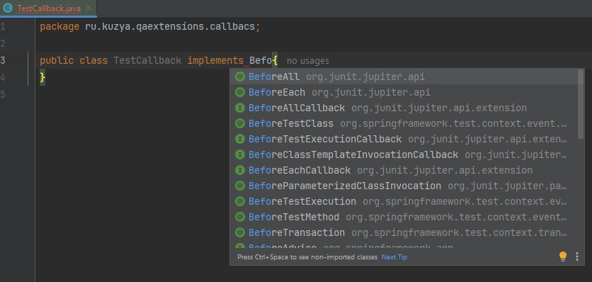

# Callback

```java
   @BeforeEach
    void setUp() {
        System.out.println("     Before each test");
    }

    @BeforeAll
    static void beforeAll() {
        System.out.println("    Before all tests");
    }
```
Вместо этих аннотаций можно применять отдельные классы Callback


```java
public class TestCallback implements BeforeAllCallback {
    @Override
    public void beforeAll(ExtensionContext context) throws Exception {
        
    }
}
```