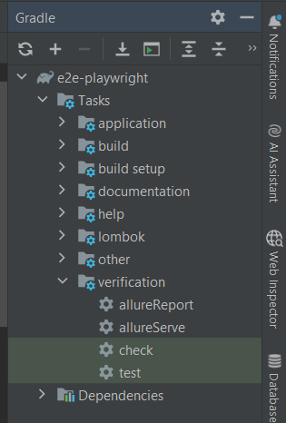

# Playwright Java - Краткое руководство по основным компонентам
Сделано на основе видео **Oleh Pendrak**  
*"Playwright на Java: Лучшая архитектура тестов с allure, видео и скриншотами! | Java QA 
Automation"*
https://www.youtube.com/watch?v=4rDHuZNcSM8

## Properties
### allure.properties
Куда будут сохраняться тесты после выполнения. Изначально всегда генерирует в папку *"build/allure-results"* и 
генерирует отчет.  
```properties
allure.results.directory=build/allure-results
```
Вызывая AllureReport allureServe он смотрит в эту директорию.  

### config.properties
Глобальные настройки для проекта. 
```properties
base.url=https://www.saucedemo.com/
base.test.video.path=build/testvideo/
browser=chromium //firefox
headless=false // запускать тесты без отображения
slow.motion=50 // скорость 
timeout=10000 // мс Время проверки
video=true // Записывать видео или нет
```

### junit-platform.properties
Для параллельного запуска тестов 
```properties
junit.jupiter.execution.parallel.enabled=true
junit.jupiter.execution.parallel.mode.default=same_thread
junit.jupiter.execution.parallel.mode.classes.default=concurrent
junit.jupiter.execution.parallel.config.strategy=dynamic
junit.jupiter.execution.parallel.config.dynamic.factor=0.5
```


## 1. Структура проекта Playwright Java

```
src/test/java/
├── config/
│   ├── Configuration.java        # Интерфейс конфигурации
│   └── ConfigurationManager.java # Менеджер конфигурации
├── factories/
│   ├── BrowserFactory.java       # Фабрика браузеров
│   └── BasePageFactory.java      # Фабрика страниц
├── pages/
│   ├── BasePage.java            # Базовый класс страницы
│   ├── LoginPage.java           # Пример страницы
│   └── components/              # Компоненты
├── tests/
│   ├── BaseTest.java            # Базовый тест
│   └── LoginTest.java           # Пример теста
└── utils/
    └── BrowserManager.java      # Менеджер браузеров
```

## 2. Основные интерфейсы и классы

### **Playwright** - Главный класс для управления браузерами
```java
import com.microsoft.playwright.Playwright;

public class PlaywrightExample {
   @Test
   @SneakyThrows
   void основныеМетоды() {
      try (Playwright playwright = Playwright.create()) {
         // Создание экземпляра браузера
         Browser browser = playwright.chromium().launch(
                 new BrowserType.LaunchOptions()
                         .setHeadless(false) // ← ВАЖНО: браузер будет виден
                         .setDevtools(true) // Открыть DevTools
                         .setArgs(Arrays.asList("--start-maximized")) // Запуск максимизированным
                         .setSlowMo(500) // ← Опционально: замедлить действия на 500ms для наглядности
         );

         BrowserContext context = browser.newContext(
                 new Browser.NewContextOptions()
                         .setViewportSize(1920, 1080) // ← Опционально: установить размер окна
         );

         Page page = context.newPage();

         // Выполнение действий
         page.navigate("https://example.com");
         System.out.println("Заголовок страницы: " + page.title());
         // Сделать скриншот для проверки
         page.screenshot(new Page.ScreenshotOptions()
                 .setPath(Paths.get("screenshot.png")));

         // Можно добавить паузу, чтобы увидеть результат
         page.waitForTimeout(3000); // Пауза 3 секунды
         Assertions.assertEquals("Example Domain", page.title(), "Название страницы должно совпадать");
         // Закрытие ресурсов
         page.close();
         context.close();
         browser.close();
      }
   }
}
```

### **Browser** - Интерфейс для работы с браузером
```java
public interface Browser extends AutoCloseable {
    // Основные методы:
    
    // Создание нового контекста
    BrowserContext newContext();
    BrowserContext newContext(Browser.NewContextOptions options);
    
    // Создание новой страницы
    Page newPage();
    
    // Получение списка открытых контекстов
    List<BrowserContext> contexts();
    
    // Получение типа браузера
    BrowserType browserType();
    
    // Проверка, запущен ли браузер
    boolean isConnected();
    
    // Закрытие браузера
    void close();
    void close(Browser.CloseOptions options);
    
    // События
    default void onDisconnected(Consumer<Browser> handler) { ... }
}
```

### **Browser.NewContextOptions** - Настройки контекста
```java
Browser.NewContextOptions options = new Browser.NewContextOptions()
    .setViewportSize(1920, 1080)        // Размер окна
    .setIgnoreHTTPSErrors(true)         // Игнорировать SSL ошибки
    .setUserAgent("Custom User Agent")  // Пользовательский агент
    .setLocale("ru-RU")                 // Локаль
    .setTimezoneId("Europe/Moscow")     // Часовой пояс
    .setPermissions(List.of("geolocation")) // Разрешения
    .setRecordVideoDir(Paths.get("videos/")) // Запись видео
    .setRecordVideoSize(1280, 720);     // Размер видео
```

### **Page** - Интерфейс для работы со страницей
```java
public interface Page extends AutoCloseable {
    // Основные методы:
    
    // Навигация
    Response navigate(String url);
    Response navigate(String url, Page.NavigateOptions options);
    
    // Взаимодействие с элементами
    void click(String selector);
    void click(String selector, Page.ClickOptions options);
    
    void fill(String selector, String value);
    void type(String selector, String text);
    
    // Получение элементов
    Locator locator(String selector);
    ElementHandle querySelector(String selector);
    List<ElementHandle> querySelectorAll(String selector);
    
    // Ожидания
    void waitForTimeout(double timeout);
    void waitForSelector(String selector);
    void waitForSelector(String selector, Page.WaitForSelectorOptions options);
    void waitForURL(String url);
    
    // Утверждения
    LocatorAssertions expect();
    PageAssertions assertThat();
    
    // События
    default void onLoad(Consumer<Page> handler) { ... }
    default void onDialog(Consumer<Dialog> handler) { ... }
    default void onConsoleMessage(Consumer<ConsoleMessage> handler) { ... }
    
    // Скриншоты
    byte[] screenshot();
    byte[] screenshot(Page.ScreenshotOptions options);
    
    // Закрытие страницы
    void close();
    void close(Page.CloseOptions options);
}
```

### **Locator** - Локатор элементов (рекомендуемый способ)
```java
public interface Locator {
    // Основные методы:
    
    // Действия
    void click();
    void click(Locator.ClickOptions options);
    
    void fill(String value);
    void type(String text);
    
    void check();
    void uncheck();
    
    // Получение значений
    String textContent();
    String innerText();
    String getAttribute(String name);
    
    // Проверки
    boolean isVisible();
    boolean isHidden();
    boolean isEnabled();
    boolean isDisabled();
    boolean isChecked();
    
    // Ожидания
    void waitFor();
    void waitFor(Locator.WaitForOptions options);
    
    // Поиск внутри элемента
    Locator locator(String selector);
    
    // Получение нескольких элементов
    List<Locator> all();
}
```

### **BaseComponent** - Базовый класс для компонентов
```java
import com.microsoft.playwright.Locator;

public abstract class BaseComponent {
    protected Locator rootLocator;
    protected Page page;
    
    public BaseComponent(Page page, String selector) {
        this.page = page;
        this.rootLocator = page.locator(selector);
    }
    
    public BaseComponent(Locator rootLocator) {
        this.rootLocator = rootLocator;
        this.page = rootLocator.page();
    }
    
    // Проверка видимости компонента
    public boolean isVisible() {
        return rootLocator.isVisible();
    }
    
    // Ожидание появления компонента
    public void waitForComponent() {
        rootLocator.waitFor();
    }
}
```

## 3. Примеры использования

### Фабрика браузеров
```java
public enum BrowserFactory {
    CHROMIUM {
        @Override
        public Browser createInstance(Playwright playwright) {
            return playwright.chromium().launch(options());
        }
    },
    FIREFOX {
        @Override
        public Browser createInstance(Playwright playwright) {
            return playwright.firefox().launch(options());
        }
    },
    WEBKIT {
        @Override
        public Browser createInstance(Playwright playwright) {
            return playwright.webkit().launch(options());
        }
    };
    
    public BrowserType.LaunchOptions options() {
        return new BrowserType.LaunchOptions()
            .setHeadless(Config.HEADLESS)
            .setArgs(List.of("--start-maximized"))
            .setSlowMo(100); // Замедление действий на 100ms
    }
    
    public abstract Browser createInstance(Playwright playwright);
}
```

### Page Object Model (POM)
```java
public class LoginPage extends BasePage {
    
    // Локаторы
    private final Locator usernameInput = page.locator("#user-name");
    private final Locator passwordInput = page.locator("#password");
    private final Locator loginButton = page.locator("#login-button");
    private final Locator errorMessage = page.locator(".error-message");
    
    public LoginPage(Page page) {
        super(page);
    }
    
    // Методы страницы
    public LoginPage open() {
        page.navigate("https://www.saucedemo.com/");
        return this;
    }
    
    public LoginPage enterUsername(String username) {
        usernameInput.fill(username);
        return this;
    }
    
    public LoginPage enterPassword(String password) {
        passwordInput.fill(password);
        return this;
    }
    
    public ProductsPage clickLogin() {
        loginButton.click();
        return new ProductsPage(page);
    }
    
    public String getErrorMessage() {
        return errorMessage.textContent();
    }
    
    // Комбинированный метод
    public ProductsPage login(String username, String password) {
        return open()
            .enterUsername(username)
            .enterPassword(password)
            .clickLogin();
    }
}
```

### Компоненты
```java
public class Header extends BaseComponent {
    private final Locator cartIcon = rootLocator.locator(".shopping_cart_link");
    private final Locator menuButton = rootLocator.locator("#react-burger-menu-btn");
    private final Locator cartBadge = rootLocator.locator(".shopping_cart_badge");
    
    public Header(Page page) {
        super(page, ".primary_header");
    }
    
    public CartPage openCart() {
        cartIcon.click();
        return new CartPage(page);
    }
    
    public Menu openMenu() {
        menuButton.click();
        return new Menu(page);
    }
    
    public int getCartItemsCount() {
        if (cartBadge.isVisible()) {
            return Integer.parseInt(cartBadge.textContent());
        }
        return 0;
    }
}
```

### Базовый тест
```java
import org.junit.jupiter.api.*;
import com.microsoft.playwright.*;

@TestInstance(TestInstance.Lifecycle.PER_CLASS)
public class BaseTest {
    protected Playwright playwright;
    protected Browser browser;
    protected BrowserContext context;
    protected Page page;
    
    @BeforeAll
    void launchBrowser() {
        playwright = Playwright.create();
        browser = playwright.chromium().launch(
            new BrowserType.LaunchOptions().setHeadless(false)
        );
    }
    
    @BeforeEach
    void createContextAndPage() {
        context = browser.newContext(
            new Browser.NewContextOptions()
                .setViewportSize(1920, 1080)
                .setRecordVideoDir(Paths.get("videos/"))
        );
        page = context.newPage();
    }
    
    @AfterEach
    void closeContext() {
        context.close();
    }
    
    @AfterAll
    void closeBrowser() {
        browser.close();
        playwright.close();
    }
}
```

## 4. Полезные методы и паттерны

### Ожидания (Waits)
```java
// Ожидание загрузки страницы
page.waitForLoadState(LoadState.LOAD); // Полная загрузка
page.waitForLoadState(LoadState.DOMCONTENTLOADED); // DOM загружен
page.waitForLoadState(LoadState.NETWORKIDLE); // Нет сетевых запросов

// Ожидание элемента
page.waitForSelector("#element", 
    new Page.WaitForSelectorOptions().setTimeout(10000));

// Ожидание URL
page.waitForURL("**/dashboard");

// Ожидание функции
page.waitForFunction("window.innerWidth > 1000");
```

### Утверждения (Assertions)
```java
import static com.microsoft.playwright.assertions.PlaywrightAssertions.assertThat;

// Проверка элемента
assertThat(page.locator("h1")).hasText("Welcome");
assertThat(page.locator("#button")).isVisible();
assertThat(page.locator("#input")).isEmpty();

// Проверка страницы
assertThat(page).hasURL("https://example.com");
assertThat(page).hasTitle("Example Domain");

// Проверка нескольких элементов
assertThat(page.locator(".item")).hasCount(5);
```

### Загрузка файлов
```java
// Ожидание загрузки файла
Download download = page.waitForDownload(() -> {
    page.locator("#download-button").click();
});

// Сохранение файла
download.saveAs(Paths.get("downloads/" + download.suggestedFilename()));
```

### Загрузка файлов на сервер
```java
// Выбор файла для загрузки
page.locator("input[type='file']").setInputFiles(
    Paths.get("test-data/photo.jpg")
);

// Выбор нескольких файлов
page.locator("input[type='file']").setInputFiles(new Path[]{
    Paths.get("file1.txt"),
    Paths.get("file2.txt")
});

// Очистка выбранных файлов
page.locator("input[type='file']").setInputFiles(new Path[0]);
```

### Работа с iframe
```java
// Получение фрейма
Frame frame = page.frame("frame-name");
Frame frame = page.frameByUrl("**/login");

// Работа внутри фрейма
frame.locator("#username").fill("user");
frame.locator("#password").fill("pass");
frame.locator("#submit").click();
```

## 5. Лучшие практики

1. **Всегда используйте Locator вместо ElementHandle**
   ```java
   // Хорошо
   page.locator("#button").click();
   
   // Плохо
   page.querySelector("#button").click();
   ```

2. **Используйте Page Object Pattern**
    - Каждая страница - отдельный класс
    - Методы возвращают экземпляры страниц
    - Локаторы приватные

3. **Конфигурируйте таймауты**
   ```java
   // В настройках контекста
   context.setDefaultTimeout(30000); // 30 секунд
   page.setDefaultTimeout(10000); // 10 секунд
   ```

4. **Используйте Allure для отчетов**
   ```java
   @Step("Выполнить вход с логином {username}")
   public ProductsPage login(String username, String password) {
       // ...
   }
   ```

5. **Очищайте ресурсы**
   ```java
   @AfterEach
   void tearDown() {
       if (page != null) page.close();
       if (context != null) context.close();
   }
   ```

6. **Параллельный запуск**
   ```java
   // Каждый тест должен создавать свой контекст
   // Не используйте общую страницу между тестами
   ```

Это основные концепции и методы Playwright для Java. Начните с простых тестов и постепенно добавляйте сложность, используя паттерны, описанные выше.