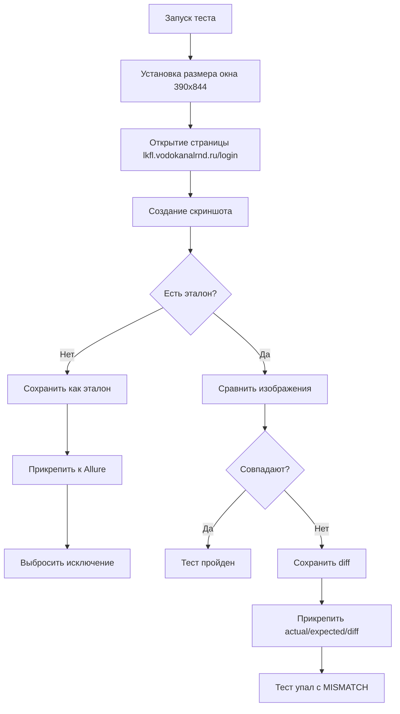
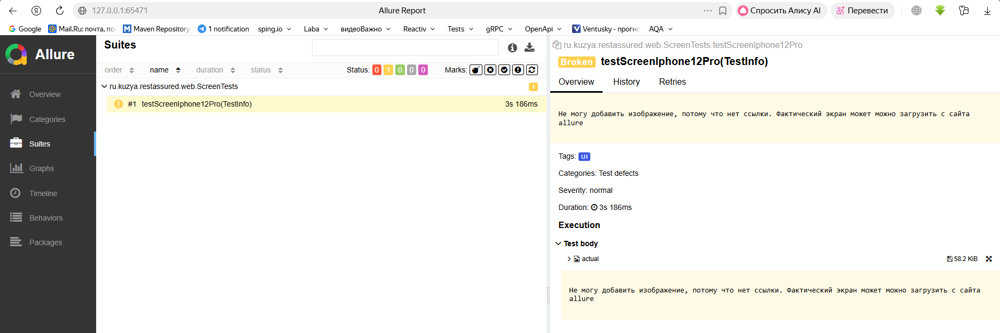
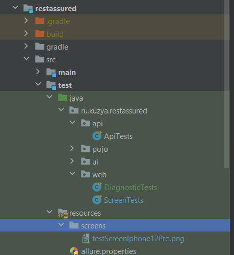
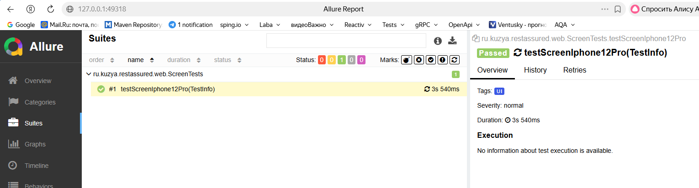
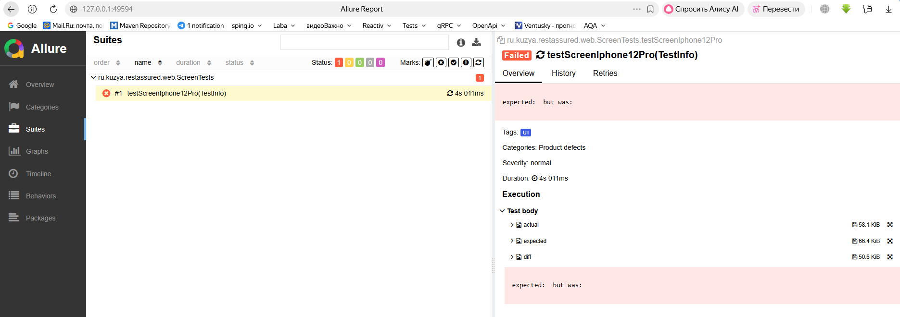
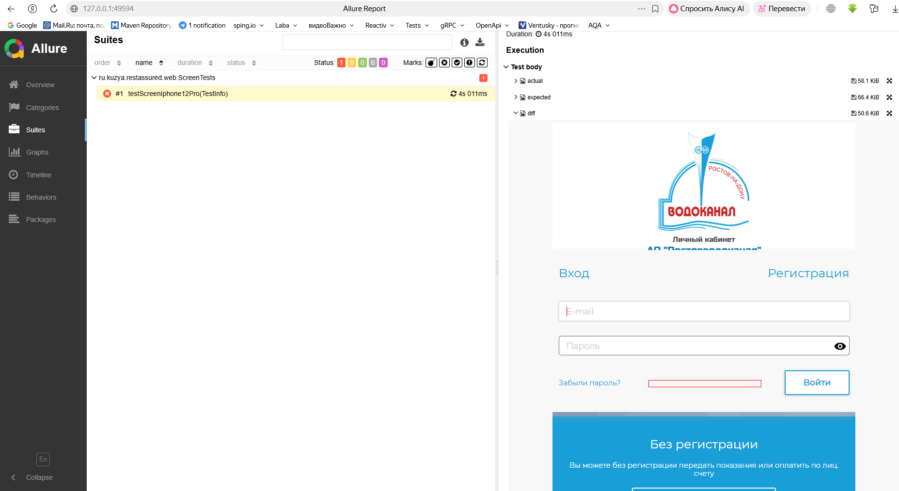

# Тестирование верстки Selenide

https://www.youtube.com/watch?v=cOPZB6-Wq1U

## 🔍 Общее описание

Класс ScreenTests реализует визуальное (скриншотное) тестирование веб-страниц. Он делает скриншот страницы и сравнивает
его с эталонным изображением, выявляя визуальные расхождения.

## 🎯 Назначение

- Проверка верстки — выявление изменений в UI
- Регрессионное тестирование — контроль визуальных изменений
- Allure интеграция — автоматическое прикрепление скриншотов к отчету

## 📁 Структура директорий

```text
📁 src/test/resources/screens/     # Эталонные скриншоты
📁 build/diffs/                     # Скриншоты с расхождениями
📁 build/allure-results/            # Результаты для Allure (автоматически)
```

## 🔄 Алгоритм работы



## 📝 Детальное описание методов

**testScreenIphone12Pro(TestInfo testInfo)**
Основной тестовый метод:

- Устанавливает размер окна браузера под iPhone 12 Pro (390×844)
- Открывает тестируемую страницу
- Вызывает метод сравнения скриншотов

**assertScreen(TestInfo testInfo)**  
Ядро логики сравнения:

 Шаг | 	Действие                 | 	Описание                                       |
-----|---------------------------|-------------------------------------------------|
| 1   | 	Формирование имени файла | 	testScreenIphone12Pro.png (из имени теста)     |
| 2   | 	Создание директорий	     | screens/ и diffs/ при необходимости             |
| 3   | 	Получение скриншота	     | Selenide.screenshot(OutputType.FILE)            |
| 4   | 	Проверка эталона	        | Если нет — сохраняет текущий как эталон         |
| 5   | 	Сравнение изображений	   | Использует библиотеку image-comparison          |
| 6   | 	Анализ результата	       | MATCH или MISMATCH                              |
| 7   | 	Сохранение diff	         | При несовпадении                                |
| 8   | 	Прикрепление к Allure	   | Всегда для actual, при ошибке для expected/diff |

**addImgToAllure(String name, File file)**
Подготовка файла для Allure:

1. Читает файл в массив байтов

2. Вызывает saveScreenshot для прикрепления

**@Attachment saveScreenshot(String name, byte[] image)**  
Ключевой метод для Allure:

- Аннотация @Attachment указывает Allure сохранить возвращаемые данные

- value = "{name}" — динамическое имя вложения

- type = "image/png" — MIME-тип для корректного отображения

- Возвращаемый byte[] автоматически сохраняется в отчет

**createDirectoryIfNotExists(String path)**  
Утилитный метод для создания директорий:

- Проверяет существование
- Создает при необходимости

## 🔧 Важные особенности

1. Первый запуск

```java
if(!expectedScreenshot.exists()){

addImgToAllure("actual",actualScreenshot);  // Сохраняем в Allure
    Files.

copy(actualScreenshot.toPath(), ...);  // Создаем эталон
        throw new

IllegalArgumentException(...);      // Прерываем тест
}
```

Результат: создается эталонный скриншот, тест падает с информативным сообщением.

2. Последующие запуски

- Сравнение с эталоном

- При несовпадении — дифф-изображение и все три скриншота в Allure

3. Allure интеграция

```java

@Attachment(value = "{name}", type = "image/png")
private static byte[] saveScreenshot(String name, byte[] image) {
    return image;  // Просто возвращаем, Allure сам сохранит
}
```

## 📊 Типы вложений Allure

| Имя       | 	Условие    | 	Описание                         |
|-----------|-------------|-----------------------------------|
| actual	   | Всегда	     | Текущий скриншот                  |
| expected	 | При ошибке	 | Эталонный скриншот                |
| diff 	    | При ошибке	 | Изображение с подсветкой различий |

## 🎯 Пример работы

### Ситуация 1: Нет эталона

text

1. Делается скриншот
2. Сохраняется в src/test/resources/screens/
3. Прикрепляется к Allure как "actual"
4. Тест падает: "Создан эталонный скриншот"

### Ситуация 2: Есть эталон, страница не изменилась

text

1. Сравнение проходит успешно
2. Тест зеленый
3. В Allure только actual скриншот

### Ситуация 3: Есть эталон, страница изменилась

text

1. Обнаружено расхождение
2. Создается diff-изображение
3. В Allure прикрепляются все три скриншота
4. Тест падает с MISMATCH

## 📌 Важные замечания

1. Запуск через Gradle обязателен для работы Allure вложений

2. Первый запуск всегда падает — это нормально

3. Размер окна фиксирован (390×844) для стабильности сравнения

4. Все пути относительные — работают на любой ОС

---------------
# Запускаем тест ScreenTests.java

```bash
./gradlew uiTests --tests "*.testScreenIphone12Pro"
```

```bash
gradle allureServe
```


В папке появится скриншот

Запускаем тест во второй раз

```bash
./gradlew uiTests --tests "*.testScreenIphone12Pro"
```

```bash
gradle allureServe
```

Тест прошел. Скрины соответствуют друг другу.


## Если скрины отличаются, то создаются три скриншота

исправили скриншот в папке screens.  
Запустили тест и отчет


В файле diff можно увидеть чем отличаются скрины

за это отвечает код

```java
        ImageComparison imageComparison = new ImageComparison(expectedImage, actualImage, resultDestination);
ImageComparisonResult result = imageComparison.compareImages();

        if(!result.

getImageComparisonState().

equals(ImageComparisonState.MATCH)){

addImgToAllure("actual",actualScreenshot);

addImgToAllure("expected",expectedScreenshot);

addImgToAllure("diff",resultDestination);
// Сохраняем diff если его еще нет
            if(!resultDestination.

exists()){
        try{
        ImageComparisonUtil.

saveImage(resultDestination, result.getResult());
        }catch(
Exception e){
        log.

error("Не удалось сохранить diff",e);
                }
                        }
                        }
```

## или DiagnosticTests.java

```bash
# 1. Запустить только DiagnosticTests
./gradlew uiTests --tests "*.DiagnosticTests"

# 2. Запустить только testScreenIphone12Pro
./gradlew uiTests --tests "*.testScreenIphone12Pro"

# 3. Запустить с отчетом Allure
./gradlew clean uiTests --tests "*.testScreenIphone12Pro" allureServe

# 4. На Windows (если не работают кавычки)
gradlew uiTests --tests *.DiagnosticTests
```
